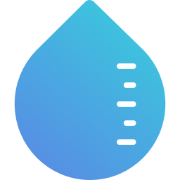

# noah



noah will let you know the water level of the nearest river in the menu bar.

## :droplet: Getting Started

```sh
# Clone this repository
$ git clone git@github.com:Noah0x0/noah.git

# Go into the repository
$ cd noah

# Install dependencies
$ yarn install

# Run the app
$ yarn start
```

## :droplet: Credits

by [FontAwesome](http://fontawesome.io/)

## :droplet: Downloads

You can download beta version for mac.

https://drive.google.com/open?id=0B6uzpRVjk9MVUkQ2OXNjWE16WFE
